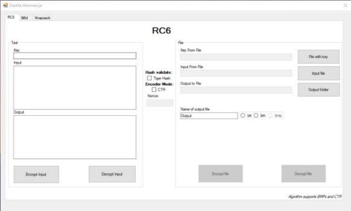
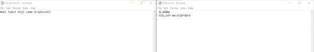
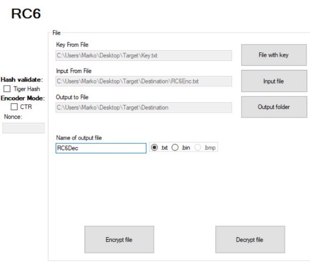
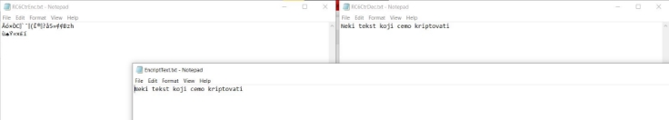

# Zastita informacija PROJEKAT

**Grupa 3** 

**Zadaci:** 

- A1 – RC6 
- A2 – Bifid 
- A3 – Knapsack 
- A4 – CTR (primenjen uz **RC6**) 
- B1 – Metoda za ucitavanje i upis niza bajtova i karaktera u fajl 
- B2 – Metoda za ucitavanje i kreiranje 24-bit slike kao rezultat kriptovanja (primenjen uz **RC6**) 
- B3 – Tiger Hash 
- B4 – Paralelizacija (uradjena uz **Knapsack** algoritam) 

Napomene: 

- Pri pokretanju visual studia potrebno je WindowsForm1 postaviti kao StartUp Project zato sto se pri pakovanju u zip format ovo narusava. 
- U tutorijalu je prikazano samo koriscenje enkritpovanje i dekriptovanje iz fajlova. U svakom od tabova (osim za knapsack) postoji i levi deo gde mozemo direktno da unosimo tekst u formu i enkriptujemo i dekriptujemo. To sam implementirao kako bih sebi olaksao testiranje u fazi implementacije algoritama, a za nas je bitno enkriptovanje i dekriptovanje vezano za fajlove, posto se to trazilo u zadatku. 
- Iz teksta koji smo dobili sam zakljucio da je A4 mod kodera i metoda za kriptovanje 24-bitnih BMP fajlova potrebno upotrebiti za jedan od algoritama pa sam ih upotrebio u RC6 algoritmu. 
- Paralelizacija je upotrebljena u Knapsack algoritmu gde mozemo oznaciti vise fajlova a zatim ih koriscenjem vise paralelnih niti citamo kodiramo i upisujemo u fajl. 
- Validacija pomocu Tiger Hasha se radi tako sto se stiklira checkbox Tiger Hash pre bilo koje enkripcije. Ukoliko je polje stiklirano generisace se i sacuvati hash vrednost u samoj formi a kasnije prilikom dekripcije ce se proveriti hash vrednost dekriptovanog fajla sa vrednoscu malopredasnje generisanog hash-a originalnog fajla. 

**Tutorijal** 

Ovako izgleda pocetna forma pri pokretanju aplikacije(Slika1): 

Slika1 

Kao sto sam napomenuo za nas je bitno enkriptovanje i dekriptovanje iz fajl sistema. Ove opcije uglavnom se nalaze na desnoj strani.  

Dugmici za enkripciju i dekripciju su na pocetku disable-ovani i bice takvi sve do momenta dok ne unesemo putanje u odgovarajuca polja. Obavezna polja koja trebamo popuniti su: 

**Key From File**: - Putanja do kljuca koji je potreban za enkripciju/dekripciju odgovarajuceg algoritma **Input From File:** - Putanja fajla koji se enkriptuje/dekriptuje 

**Output To File:** - Putanja direktorijuma u koji ce se enkriptovati/dekriptovati fajl 

**Name of output file:** - Ime izlaznog fajla 

**Radio buttons:** - Odabir ekstenzije izlaznog fajla (moguce je i u txt i bin formatu, za RC6 je podrzan i bmp format) 

**RC6** 

Enkriptovanje 

RC6 algoritam se nalazi na prvom tabu. 

Prvo sto zelimo je da izaberemo fajl u kome se nalazi kljuc. To radimo tako sto pritiskamo dugme “File with key”. (Slika2) 

Napomena: Kljuc koji se nalazi u fajlu mora biti 4 karaktera ili duzi. 

Slika2 

Slika3 

Isti postupak cemo ponoviti i za unos Input fajla i Output direktorijuma (Slika4, Slika5) 

Slika4 

Slika5 

Na kraju otkucacemo ime zeljenog Output fajla i izabrati njegovu ekstenziju i pritiskamo “Encrypt file” dugme sto ce rezultirati enkriptovanim fajlom u direktorijumu koji smo odabrali. 

Slika6 

**Originalni fajl   Enkriptovani fajl **

Dekriptovanje 

Ponavljamo isti postupak kao za enkripciju s tim da za input fajl koristimo rezultat prethodne enkripcije. 

**Slika7** 

**Rezultat** 

CTR Mod 

CTR mod algoritma RC6 ukljucicemo tako sto cemo samo stiklirati checkbox CTR i uneti Nonce vrednost od 4 karaktera. Nakon toga obavicemo isti postupak. 

Slika8 

Kriptovanje bitmapa 

Ponovicemo isti postupak s tim da cemo za input fajl izabrati bitmapu. Ukoliko je sve kako treba izaci ce poruka da ste uspesno enkriptovali bitmapu. 

Slika9 ![ref1]![ref1]

**Polazna bitmapa           Rezultat enkripcije        Rezultat dekripcije** 

**Napomena:** Rad sa bitmapa podrzan je samo RC6 algoritmom. U CTR modu dobija se mnogo bolji rezultat enkripcije 

**Bifid** 

Postupak za enripciju i dekripciju algoritma bifid algoritmom isti je kao i predasnji. 

Jedina osobenost kod ovog algoritma je mogucnost random generisanje 5x5 kljuca za ovaj algoritam i njegovo snimanje na disk kako bi kasnije mogao da se uveze i koristi za enkripciju. Ovo generisanje nalazi se na levoj strani forme(Slika10) 

||
| :- |
||
**Slika10** 

**Knapsack** 

Kod ovog algoritma takodje postoji mogucnost generisanje random kljuca i mogucnost njegovog usnimavanja na disk. U ovom algoritmu kljuc koji generisemo mozemo direktno koristiti za enkripciju bez njegovog ucitavanja. 

Paralelizacija 

Ovaj algoritam nam pruza mogucnost paralelizacije. Pri biranju fajlova za enkripciju/dekripciju imamo mogucnost oznacavanje vise fajlova. Kasnije, pri odabiru opcije “Encrypt files” vise paralelnih niti ce ucitati i enkriptovati odgovarajuce fajlove i upisati ih u odgovarajuci direktorijum. Isti slucaj je i za dekriptovanje. 

**Slika11** 

**Primer nakon enkripcije i dekripcije vise fajlova** 

**Tiger Hash** 

Tiger Hash validacija postoji za sve algoritme. Nju koristimo tako sto pre same enkripcije check-iramo checkbox TigerHash nakon cega ce da se vrednost Hash funkcije za originalni fajl da se zapamti u context-u forme. Nakon toga pri dekriptovanju fajlova hash funkcija originalnog i novodobijenog dekriptovanog fajla ce se uporediti i ukoliko su iste dobicemo poruku o uspesnom sifrovanju, u suprotnom dobicemo negativnu poruku. 

Slika12 

[ref1]: imgs/Aspose.Words.02d409bf-bf11-49c9-8074-31770d2a47bd.021.png
